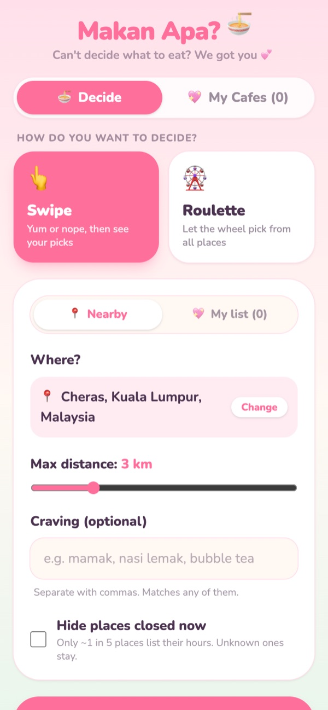
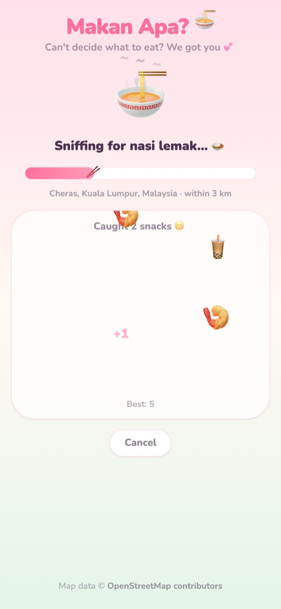
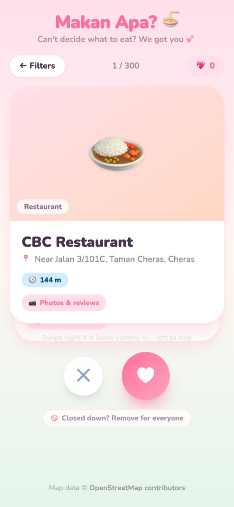
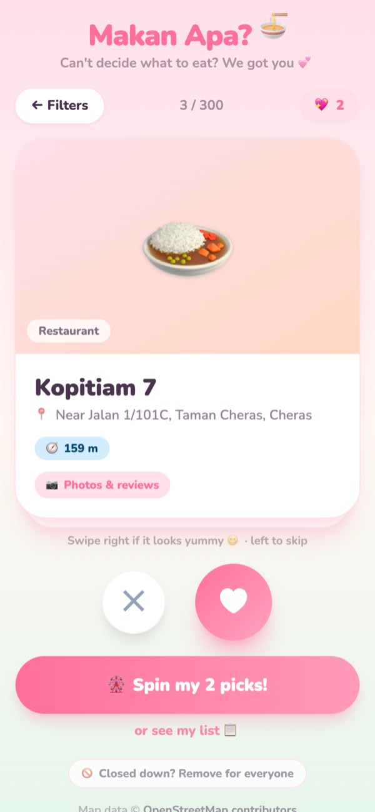
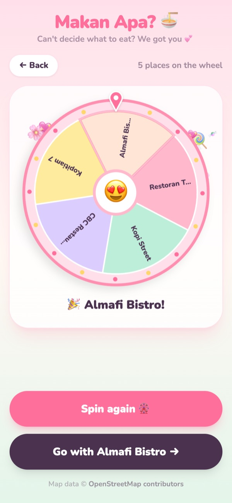
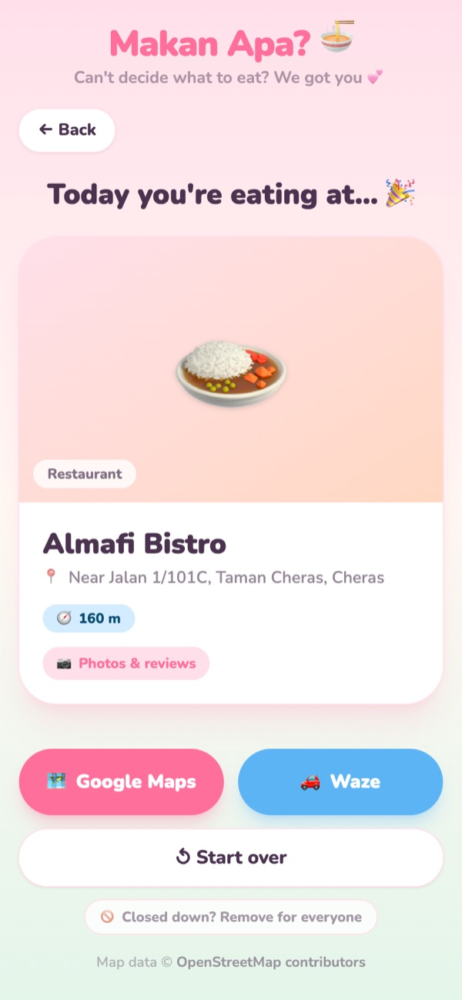
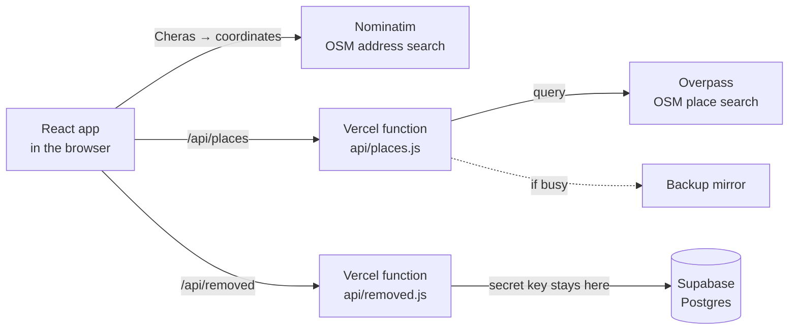

# Makan Apa? 🍜

**Can't decide what to eat? Swipe or spin nearby food spots in Malaysia.**

[](https://github.com/jimmyytai0619/makan-picker/actions/workflows/ci.yml)
[](https://makan-picker.vercel.app)

👉 **Try it:** https://makan-picker.vercel.app (made for phones, works on laptops too)

<table>
  <tr>
    <td></td>
    <td></td>
    <td></td>
  </tr>
  <tr>
    <td></td>
    <td></td>
    <td></td>
  </tr>
</table>

## Features

- **Two ways to decide:** 👆 **Swipe** (Tinder style: right = yum, left = nope) or 🎡 **Roulette** over every place nearby
- **Spin your picks:** after 2 likes, a *Spin my picks* button appears (with confetti) so the wheel chooses between them
- **Real places near you:** type an area or use GPS; cafes, restaurants, fast food, bakeries and bubble tea from OpenStreetMap
- **Useful cards:** distance, address (or nearest road), cuisine, open now / closed now, a *Photos & reviews* link to Google Maps
- **Go there:** one tap opens directions in Google Maps or Waze
- **My Cafes:** paste cafes you saved on Instagram / Xiaohongshu and swipe or spin them too
- **Closed down? Remove it for everyone:** a shared list, with a *Removed places* page to restore mistakes
- **Fun while you wait:** a noodle-bowl loading screen with a catch-the-snacks mini game (and your best score)
- **Pastel candy design**, with "Reduce motion" respected for people who turn it on

## How it works



- **Why a server in the middle?** Overpass rejects browser requests from the live site, but accepts server ones. The
  function also checks every input, tries a backup mirror when the main server is busy, and lets Vercel's CDN
  cache answers for a day, so repeat searches are instant.
- **The shared "closed down" list** lives in Supabase. Only the server holds the secret key, and Row Level Security is on with no
  public policies. Removals appear straight away (optimistic update). If the server can't be reached, they wait on the phone and are
  sent later, so nothing is lost.
- **The roulette is honest:** the winner is picked first, then the exact rotation is calculated so the wheel stops on it.
  Tests check every wheel size from 1 to 25 and every pocket.

## Decisions (and trade-offs)

| Decision | Why | Trade-off |
|---|---|---|
| OpenStreetMap, not Google Places | Free, no API key or credit card | No ratings or photos; the map rarely knows when a place closes (hence the shared removed list) |
| Own `/api/places` server function | Overpass blocks the live site's browser requests | A little more code, but also caching and a fallback |
| Supabase for the removed list | Free Postgres, fits Vercel, easy to inspect | The secret key must stay on the server |
| My Cafes in `localStorage` | No accounts needed | Each device has its own list |

## Tech

React 19 · Vite · Tailwind CSS v4 · Vercel (hosting + serverless functions) · Supabase (Postgres) ·
OpenStreetMap (Nominatim + Overpass) · Vitest · GitHub Actions

## Engineering highlights

- **70 automated tests** (Vitest), run by GitHub Actions on every pull request; Vercel builds a preview for each PR
- Every change goes through a branch, a pull request, the checks, a merge, and then a check of the **live** site
- Server input validation, safe links only (no `javascript:` URLs from map data), and no secrets in the browser
- Polite use of free services: a queue for Nominatim (max 1 request per second), caching, and only one retry when busy
- Swipe gestures with Pointer Events (touch, mouse and ← → keys), plus `aria-live` for screen readers

## Run it locally

```bash
npm install
npm run dev      # http://localhost:5173 (add -- --host to open it on your phone)
npm test         # run the tests
npm run build    # build like Vercel does
```

The shared removed list works without any setup when you run the app locally (it's kept in memory). To connect a real database, create the table
with [`docs/supabase.sql`](docs/supabase.sql) and set these on the server (e.g. via Vercel → Storage → Supabase):

| Variable | What it is |
|---|---|
| `SUPABASE_URL` | Your Supabase project URL |
| `SUPABASE_SERVICE_ROLE_KEY` | The secret key (server only, never put it in `VITE_` variables) |

## Project structure

```
api/            places.js (map search proxy) · removed.js + _removedStore.js (shared removed list)
src/
  App.jsx       app state, search flow, which screen to show
  screens/      Filter · Swipe · Picks · Roulette · Result · Saved (My Cafes) · Removed
  components/   RestaurantCard · SwipeableCard · LoadingScreen · Confetti · …
  hooks/        useSavedCafes · useRemovedPlaces · usePlaceAddress
  services/     osm.js (all map calls) · removed.js
  utils/        pure, tested helpers (roulette maths, swipe, address, likes, …)
docs/           notes on how it was built
```

## Behind the scenes

- [`docs/PROGRESS.md`](docs/PROGRESS.md): my development notes, step by step
- [`docs/HOW-IT-WORKS.md`](docs/HOW-IT-WORKS.md): the full guide (one search followed through every file)
- [`docs/NOTES.md`](docs/NOTES.md): my first notes from Phase 1

Started on 10 Sep 2026 by [@jimmyytai0619](https://github.com/jimmyytai0619).

Map data © [OpenStreetMap contributors](https://www.openstreetmap.org/copyright).
